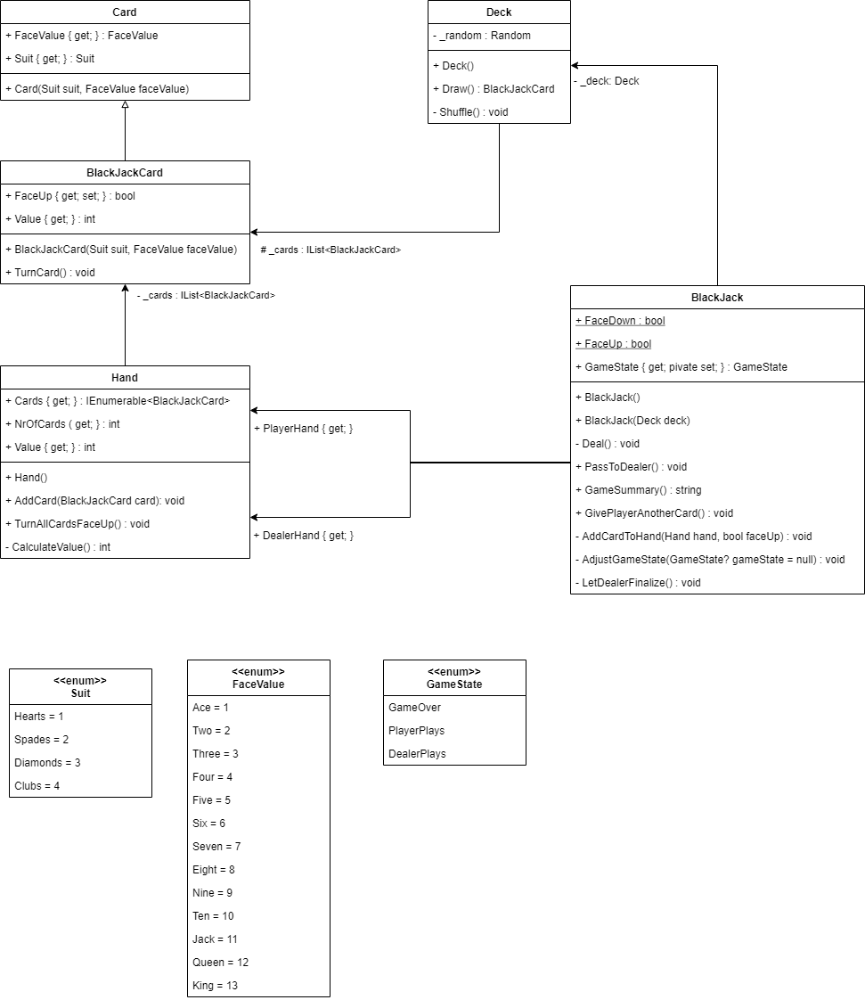

# Chapter 3 - Exercise - BlackJack

## Objectives

* Learn how to create a descent project structure
* Learn how to create a descent GIT repository
* Learn how to create a console application
* Learn how to implement a domain
* Learn how to write descent unit tests
* Learn how to link a `Class Library`, `xUnit Test Project`
* Learn how to create a solution
* Learn how to link projects to a solution

## The game

BlackJack is an easy card game. There is one dealer and at least one player. For simplicity, we'll implement a game for only one player.

The player plays againts the dealer. The goal is to draw cards untill you're as close as possible to 21 without exceeding this value. The player wins when his total is less than or equal to 21 and higher than the dealer's total. He loses when his total is higher than 21 and lower than or equal to the dealer's total. In the latter case, the dealer's total may not exceed 21.

Both player and dealer start with two cards. Only the dealer's first card is visible. The player starts: he can draw cards to come as close to 21 as possible. When the player is satisfied with the total, he gives turn to the dealer. The dealer draws cards until his total is higher than or equal to the player's total.

Every card counts for his value, except for the jack, queen and kind which stand for 10. The ace counts as 1 or 11, whatever suits you best. When your first two cards add up to 21 (10 or jack/queen/kind combined with an ace), you have Blackjack and win.

The Game has been published in a Blazor version (see later in Chapter 6) and can already be played. In this exerice you'll only implement the Domain and Unit Tests. You can start by playing the game to get a better understanding of the Domain. The deployed version can be found [here](https://hogent-web.github.io/csharp-ch-6-exercise-1/).

## Exercise

* Create the following folder structure
  * ch-3-exercise-3
    * src
    * tests
* Use a dotnet command to create a new solution in the root folder called `BlackJack`
* Use a dotnet command to create a `.gitignore` file in the root folder `ch-3-exercise-3`
* Use a `git` command to make the root folder `ch-3-exercise-3` a GIT repository
* Use a `git` command or Visual Studio to commit your changes
  * Make sure there are no binary files tracked in the repository.
* Use a `dotnet` command to create a new console application in the `src` folder called `App`
* Use a `dotnet` command to create a `class library` in the `src` folder called `Domain`
* Use a `dotnet` command to reference the `Domain` class library in the console application
* Remove the class `Class1`
* Add the `App` and `Domain` project to the `BlackJack` solution
* Use a `git` command or Visual Studio to commit your changes
* Implement the following class diagram
  * All methods should throw a `NotImplementedException`
  * [Explanation](#class-diagram-explanation) of each class can be found below

* Use a `git` command or Visual Studio to commit your changes
* Use a `dotnet` command to create an `xUnit test project` in the `tests` folder named `Domain.Tests`
* Use a `dotnet` command to reference the `Domain` class library in the test project
* Remove the class `UnitTest1.cs`
* Add the `Domain.Tests` project to the `BlackJack` solution
* Use a `git` command or Visual Studio to commit your changes
* Copy all test classes from the `main` branch into your test project and make the tests pass (also include the `DeckStubs`)
  * `CardTest`: finished test class, make it pass
  * `BlackJackCardTest`: implement the given tests and make it pass
  * `HandTest`: implement the leftover tests and make it pass

* Use a `git` command to commit your changes (_per class_)
* Create a class `DeckTest` in the test project and implement the following tests:
  * constructor creates a deck of 52 `BlackJackCard`s
  * method `Draw` returns an object of type `BlackJackCard`
  * method `Draw` throws an `InvalidOperationException` when the deck is empty
* Use a `git` command to commit your changes
* Copy the `BlackJackTest` class and make it pass
* Use a `git` command to commit your changes
* Copy the `Program.cs` from the `main` branch into your `App` project
* Use a `git` command to commit your changes
* Start playing!

## Solution

A possible solution can be found [here](https://github.com/HOGENT-Web/csharp-ch-3-exercise-1/tree/solution#solution).

## Class diagram explanation

### Card

* Contains all informatin of one card from the deck, namely the suit (hearts...) and face (1, 2, ..., king).
  * Stored in the properties `Suit` and `FaceValue`
* Has one constructor to create one card

### BlackJackCard

* Inherits from `Card`
* Stores extra information for cards in the BlackJack game
* Properties
  * `FaceUp`: whether the face of card is visible
  * `Value`: the BlackJack value of this card, 0 if the card is not visible
* Has one constructor
  * Face is not visible on creation
* Methods
  * `TurnCard`: makes the card (in)visible

### Deck

* Represents a deck of cards
* Fields
  * `_cards`: the cards in the deck
* Has one constructor
  * Creates a deck of 52 cards

> Hint: to create a deck, you can loop over all enum values using a `foreach` and `Enum.GetValues(...)`

* Methods
  * `Draw`: returns the first card from the deck, throws an `InvalidOperationException` if the deck is empty
  * `Shuffle` (private): shuffles the cards

### Hand

* Represent a player/dealer
* Fields
  * `_cards`: cards in the player's hand
* Properties
  * `Cards`: returns the player's cards
  * `NrOfCards`: returns the number of cards in this hand
  * `Value`: total value of all cards
* Has one constructor
  * Creates an empty hand
* Methods
  * `AddCard`: add a `BlackJackCard` to this hand
  * `TurnAllCardsFaceUp`: flips all cards with the face up

### BlackJack

* Represent the whole game
* Two constants
  * `FaceDown`: has value `false`
  * `FaceUp`: has value `true`
* Properties
  * `DealerHand`: dealer's hand
  * `PlayerHand`: player's hand
  * `GameState`: state of the game: player has turn, dealer has turn, game over
* Constructors
  * One constructor creates two hands and a new `Deck`
  * The other creates two hands and uses the given `Deck`
  * Remember: both of the player's cards are faced up, but only one for the dealer + the player may already have BlackJack
* Methods
  * `GivePlayerAnotherCard`: gives a new card to the player, only if the `GameState` if `PlayerPlays`. Could change the `GameState`. Throws an `InvalidOperationException` if it's not possible to draw a card with the current `GameState`.
  * `PassToDealer`: gives turn to the dealer, his cards are faced up and the `GameState` becomes `DealerPlays`. The dealer plays until `GameState` `GameOver` is reached.
  * `GameSummary`: `null` if the game isn't finished yet, possibilities:
    * Player Burned, Dealer Wins
    * Dealer Burned, Player Wins
    * Equal, Dealer Wins
    * Dealer Wins
    * Player Wins
    * BLACKJACK
  * `AddCardToHand` (private): gives a card to the given player, could be faced up/down
  * `AdjustGameState` (private):
    * could set a given `GameState`
    * Also checks the other domain rules (player/dealer has a total over 21, ...)
  * `Deal` (private): player and dealer get their initial cards
  * `LetDealerFinalize` (private): dealer plays until `GameState` is `GameOver`

